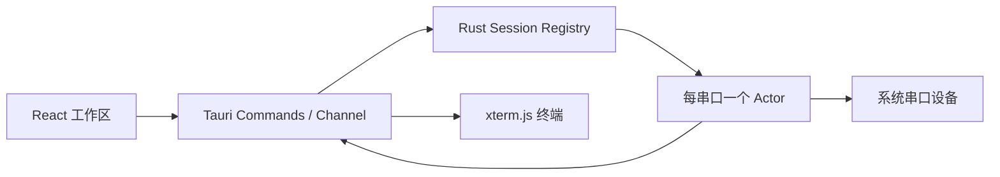

# iTerm

[](https://github.com/Oublie-le/iTerm/actions/workflows/ci.yml)
[](https://github.com/Oublie-le/iTerm/actions/workflows/release.yml)
[](https://github.com/Oublie-le/iTerm/releases/latest)

iTerm 是一个使用 Tauri 2、Rust、React 和 xterm.js 构建的跨平台桌面串口终端。
它采用本地优先的数据策略，并以 clean-room 方式复现 WindTerm 串口工作区的核心信息架构和操作体验。

> 项目处于 `0.x` 早期阶段。当前发行包未进行 Apple 公证或 Windows 商业代码签名，
> 首次运行时可能显示系统安全提示。

## 功能

- Windows、macOS 和 Linux 串口枚举；
- 多会话配置、会话树和多标签终端；
- 波特率、数据位、校验位、停止位和流控；
- DTR、RTS 与 Serial Break；
- 串口输入/输出缓冲清理；
- ANSI/xterm-256color 终端、滚动缓冲和 WebGL 加速；
- UTF-8、GBK、Big5、Shift_JIS 等 WebView 支持的字符编码；
- Text/Hex 接收双视图、可配置 Hex 列数/分组和行时间戳；
- 终端搜索、清屏和实时行列显示；
- 文本与 Hex 发送；
- LF、CR、CRLF 行尾；
- 多个发送器、循环发送和发送间隔；
- 每会话发送器模板持久化；
- 原始文件分块发送、进度显示和取消；
- 原始字节/文本日志及开始、暂停、继续、停止；
- 串口热插拔检测、稳定 USB 身份匹配和可选自动重连；
- A/B/C/D 同步输入通道与专注模式；
- RX/TX 字节统计、连接状态与设备丢失提示；
- 会话配置、标签和工作区本地持久化；
- 浏览器 Mock 模式，无串口硬件也能预览界面。

## 下载

前往 [GitHub Releases](https://github.com/Oublie-le/iTerm/releases/latest) 下载对应平台的安装包：

- macOS：Apple Silicon 与 Intel DMG；
- Windows：NSIS 安装程序；
- Linux：AppImage 与 Debian 软件包。

当前发行包为自动化构建的未签名版本。macOS 用户可能需要在“系统设置 → 隐私与安全性”
中确认打开；Linux 用户需要拥有串口设备访问权限。

## 快速开始

1. 启动 iTerm；
2. 点击“新建串口会话”；
3. 选择串口设备；
4. 设置波特率、数据位、校验位、停止位和流控；
5. 点击“保存并连接”；
6. 直接在终端输入，或使用底部发送窗格发送文本/Hex。

工具栏中的 `HEX` 可切换接收视图，`LOG` 可控制会话日志。发送窗格的文件按钮按原始
字节分块发送文件；传输期间普通键盘和发送器输入会自动锁定。

默认线路参数为 `9600 / 8 / None / 1 / None`。

### Linux 串口权限

常见发行版需要将当前用户加入 `dialout` 组：

```bash
sudo usermod -aG dialout "$USER"
```

重新登录后生效。Arch Linux 等发行版可能使用 `uucp` 组。

## 本地开发

### 环境要求

- Node.js 22；
- pnpm 11；
- Rust stable；
- 对应平台的 [Tauri 2 系统依赖](https://v2.tauri.app/start/prerequisites/)。

安装依赖：

```bash
pnpm install
```

启动原生桌面应用：

```bash
pnpm tauri:dev
```

只启动浏览器 Mock 模式：

```bash
pnpm dev
```

### 测试与构建

```bash
pnpm test
pnpm build
cargo test --manifest-path src-tauri/Cargo.toml
pnpm tauri:build
```

生成的安装包位于：

```text
src-tauri/target/release/bundle/
```

## 项目结构

```text
.
├── .github/workflows/       # CI 与跨平台 Release
├── assets/                  # 可编辑的品牌源文件
├── docs/                    # SRS、PRD、架构与实施计划
├── src/
│   ├── components/          # 工作区、终端、会话和发送器 UI
│   └── lib/                 # 前端串口 API、类型与测试
└── src-tauri/
    ├── capabilities/        # Tauri 权限边界
    └── src/                 # Rust 串口会话 Actor 与 IPC 命令
```

## 架构



每个活动串口由独立 Rust 工作线程持有。UI 通过命令执行连接、发送和控制线操作，
接收数据则通过 Tauri Channel 按序推送。端口注册表阻止同一进程内重复占用设备。

更详细的设计参见：

- [需求规格说明书](docs/01-requirements.md)
- [产品需求文档](docs/02-prd.md)
- [软件架构](docs/03-architecture.md)
- [实施与验收计划](docs/04-implementation-plan.md)

## 自动化

- `CI`：每次推送和 Pull Request 执行 TypeScript 检查、Vitest、Rust 格式检查、
  Rust 测试，并在 Linux、macOS、Windows 编译桌面程序；
- `Release`：推送 `v*` 标签或手动运行工作流时，构建三平台安装包并发布到
  GitHub Releases；
- `Dependabot`：每周检查 npm、Cargo 和 GitHub Actions 依赖更新。

发布新版本前需同步修改 `package.json`、`src-tauri/Cargo.toml` 和
`src-tauri/tauri.conf.json` 中的版本号，然后创建对应标签，例如 `v0.2.0`。

## 当前限制与路线图

当前 MVP 尚未实现：

- 日志大小限制和日志轮转；
- 横向/纵向分屏；
- 会话触发器；
- XModem、YModem、ZModem；
- 完整中英文界面和浅色/深色主题切换；
- 自动更新、代码签名和 macOS 公证。

这些功能将按照 [实施计划](docs/04-implementation-plan.md) 分阶段完成。

## 数据与隐私

iTerm 默认不连接云服务，不上传会话配置或串口内容，也不包含遥测。
会话配置保存在本机 WebView 存储中。串口内容仅在用户明确启用日志功能后才应写入磁盘。

## 项目声明

本项目是独立实现，不隶属于 WindTerm、iTerm2 或其开发者，也不包含这些项目的品牌素材。
`iTerm` 名称可能与其他终端产品近似，公开分发前应由项目所有者完成名称与商标审核。

## 许可证

仓库当前尚未声明开源许可证，默认保留所有权利。若计划接受外部使用、修改或分发，
请由仓库所有者选择并添加明确的开源许可证。
