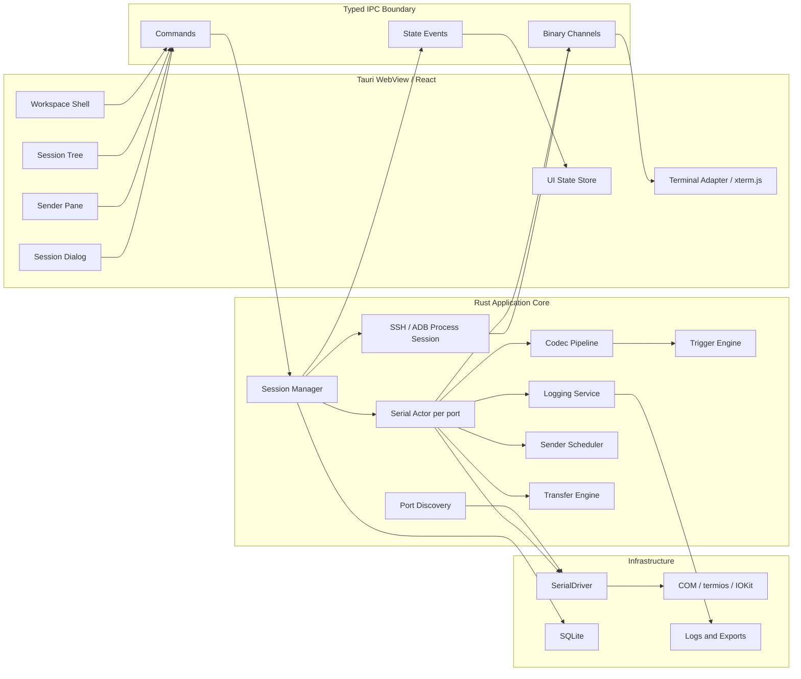
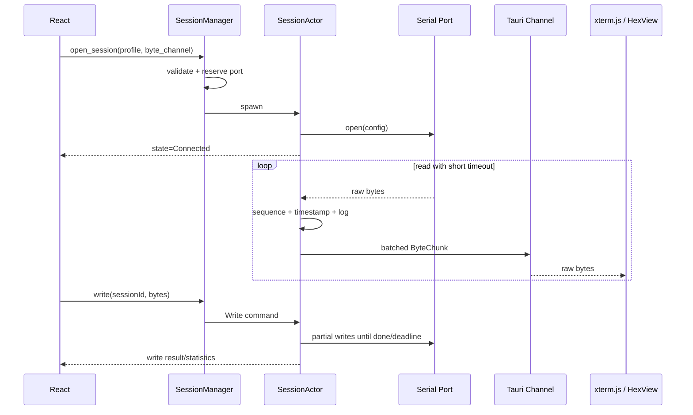
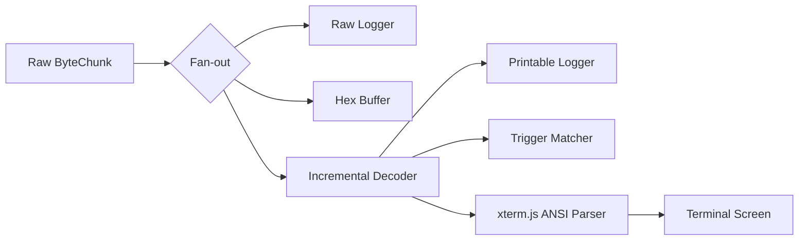
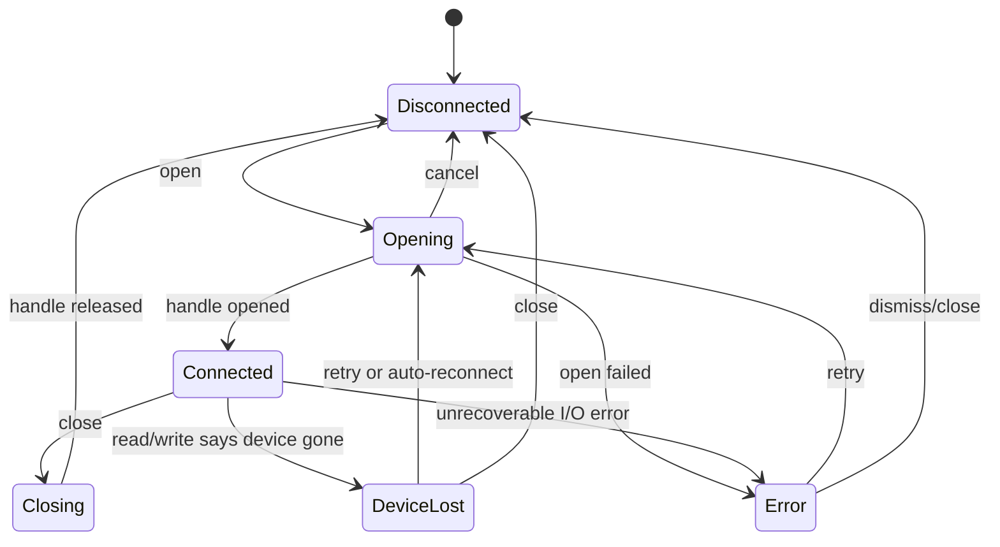

# 软件架构设计

文档状态：Draft
架构版本：v1
更新时间：2026-07-27

## 1. 架构决策摘要

推荐采用：

- **桌面壳**：Tauri 2；
- **系统与串口层**：Rust；
- **前端**：React + TypeScript + Vite；
- **终端渲染**：xterm.js；
- **串口抽象**：`serialport-rs`，外包一层自有 `SerialDriver` trait；
- **SSH**：系统 OpenSSH 客户端，参数化启动并接入本地 PTY，不经过本地 shell；
- **ADB**：Android Platform Tools `adb` 客户端、本地 PTY 和长生命周期 Shell 子进程；
- **持久化**：SQLite + 版本化迁移；
- **样式**：CSS Variables/Design Tokens + 独立组件库；
- **测试**：Rust 单测/集成测试、Vitest、Playwright 截图测试、硬件矩阵。

选择 Tauri 的原因：

1. Rust 可安全地持有串口句柄、线程和文件传输状态；
2. HTML/CSS 更适合快速收敛到 WindTerm 的像素布局；
3. xterm.js 已覆盖成熟终端模拟、Unicode、IME、搜索和 WebGL 渲染；
4. Tauri 使用系统 WebView，可在三平台构建桌面应用，并通过能力配置缩小 IPC 权限；
5. 前后端通过命令和 Channel 分离，便于将来替换终端渲染或串口实现。

参考：

- [Tauri 2 架构](https://v2.tauri.app/concept/architecture/)
- [Tauri Capabilities](https://v2.tauri.app/security/capabilities/)
- [Tauri Channel](https://v2.tauri.app/develop/calling-rust/#channels)
- [xterm.js 官方仓库](https://github.com/xtermjs/xterm.js/)
- [serialport-rs API](https://docs.rs/serialport/latest/serialport/)

## 2. 技术选型对比

| 方案 | 优点 | 缺点 | 结论 |
| --- | --- | --- | --- |
| Tauri + Rust + xterm.js | UI 收敛快、跨平台、终端成熟、包体较小 | WebView 字体差异、百万行回滚需 Spike | **采用** |
| Qt 6 Widgets + C++ + QSerialPort | 与 WindTerm 同类技术、原生菜单/停靠窗格、串口成熟 | 终端组件和高保真 UI 开发成本高、C++ 维护成本高 | 备选 |
| Electron + Node + xterm.js | 生态成熟、实现最快 | 包体和内存较大、串口原生模块分发复杂 | 不采用 |
| 全 Rust GUI | 单语言、性能可控 | 终端、IME、可访问性和复杂桌面布局生态不足 | 暂不采用 |

### 2.1 必须先验证的选型风险

- xterm.js 在 999,999 行回滚、中文输出和 WebGL 下的内存/性能；
- macOS WebKit、Windows WebView2、Linux WebKitGTK 的字体与 IME 差异；
- `serialport-rs` 在 Windows Mark/Space parity、自定义波特率和热插拔上的行为；
- Tauri Channel 在 921600 bps 与多会话下的吞吐和背压；
- X/Y/ZModem 可用库质量，不满足时需要自研协议状态机。

若 Spike 失败，不推翻领域层：只替换 `TerminalRenderer` 或 `SerialDriver` 适配器。

## 3. 总体架构



## 4. 分层与模块职责

### 4.1 表示层（React）

- `WorkspaceShell`：菜单、标签、停靠布局、分屏和状态栏；
- `SessionTree`：会话分组和上下文菜单；
- `SessionEditor`：版本化表单、实时校验、平台能力禁用；
- `TerminalView`：xterm.js 生命周期、主题、尺寸、搜索、IME；
- `HexView`：原始字节虚拟列表，不依赖解码后的终端文本；
- `SenderPane`：发送器编辑、循环状态和统计；
- `NotificationBar`：可恢复错误和会话状态；
- `TransferPanel`：传输进度、速率、取消；
- `Settings`：应用/默认会话/当前会话三层配置。

前端不得直接访问串口、文件系统或网络。

### 4.2 应用层（Rust）

- `SessionManager`：会话注册表、端口独占、生命周期和命令路由；
- `SessionActor`：一个活动串口一个 Actor，独占串口句柄；
- `ProcessRegistry`：SSH/ADB 子进程会话、标准输入输出和生命周期；
- `RemoteDiscoveryService`：解析 ADB 设备、授权和离线状态；
- `PortDiscoveryService`：枚举、稳定设备键、热插拔 diff；
- `SenderScheduler`：单次、循环、文件发送和背压；
- `LoggingService`：原始/文本日志、模板、滚动；
- `TransferService`：X/Y/ZModem 互斥传输；
- `TriggerEngine`：匹配、冷却、限次和动作调度；
- `ProfileService`：会话、分组、布局和迁移。

### 4.3 领域层

领域层不依赖 Tauri、React 或具体串口库：

```rust
trait SerialDriver {
    fn list_ports(&self) -> Result<Vec<PortDescriptor>>;
    fn open(&self, config: &SerialConfig) -> Result<Box<dyn SerialConnection>>;
}

trait SerialConnection: Send {
    fn read(&mut self, buf: &mut [u8]) -> Result<usize>;
    fn write_all_deadline(&mut self, data: &[u8], deadline: Instant) -> Result<()>;
    fn set_dtr(&mut self, value: bool) -> Result<()>;
    fn set_rts(&mut self, value: bool) -> Result<()>;
    fn send_break(&mut self, duration: Duration) -> Result<()>;
    fn clear(&mut self, target: BufferTarget) -> Result<()>;
}
```

接口是设计示例，编码时根据平台和库能力细化。

### 4.4 基础设施层

- `serialport-rs` 适配器；
- 系统 `ssh` 与 `adb` 命令适配器；
- Windows/macOS/Linux 平台能力探测；
- SQLite Repository；
- 原子配置/日志文件写入；
- 安装包、签名、自动更新（若启用）。

## 5. 串口并发模型

`serialport-rs` 为阻塞 I/O。每个活动会话使用一个专用线程/Actor，而不是在 Tauri async
运行时直接阻塞：



### 5.1 Actor 命令

- `Write(Vec<u8>, WriteId)`
- `SetDtr(bool)`
- `SetRts(bool)`
- `SendBreak(Duration)`
- `Clear(BufferTarget)`
- `StartTransfer(TransferSpec)`
- `CancelTransfer`
- `StartLog(LogSpec)`
- `PauseLog` / `ResumeLog` / `StopLog`
- `Close`

### 5.2 读取批处理与背压

- 读缓冲建议 8–64 KiB；
- 以“达到 8 KiB 或 8 ms”任一条件发送 UI 批次；
- 每个块包含 `sessionId`、单调递增 `sequence`、接收时间和原始字节；
- UI 检测 sequence 缺口并上报，不允许静默丢块；
- UI 落后时先降低渲染频率，不丢原始数据；
- 达到内存高水位时暂停读取仅在驱动/硬件流控允许时使用，否则启动本地 spool；
- 日志在解码前消费原始字节。

## 6. 原始字节、解码与终端渲染



关键原则：

- 原始字节是唯一事实源；
- 字符集解码器保持跨块状态；
- 文本发送先拼接行尾，再按字符集编码；
- Hex 发送直接产生字节，不经过字符集；
- 文本/Hex 切换不会从屏幕文本反推原始数据；
- X/Y/ZModem 期间字节流由 Transfer Engine 独占，终端只显示明确允许的旁路状态。

## 7. 状态机



状态转换只发生在 Rust 核心；前端只渲染事件，不能自行假设已连接。

## 8. IPC 设计

### 8.1 命令

| 命令 | 输入 | 输出 |
| --- | --- | --- |
| `ports_list` | 无 | `PortDescriptor[]` |
| `profile_list/get/upsert/delete` | profile/group 参数 | 对应实体 |
| `session_open` | profileId + byte Channel | sessionId |
| `session_close/reconnect` | sessionId | Ack |
| `session_write` | sessionId + raw body | WriteReceipt |
| `session_set_signal` | DTR/RTS | Ack |
| `session_send_break` | duration | Ack |
| `session_clear_buffer` | target | Ack |
| `sender_start/stop` | sender spec | jobId/Ack |
| `log_start/pause/resume/stop` | log spec | log state |
| `transfer_start/cancel` | transfer spec | transfer state |
| `workspace_load/save` | layout | layout/Ack |

### 8.2 事件

- `port-snapshot`
- `session-state-changed`
- `write-completed`
- `sender-state-changed`
- `log-state-changed`
- `transfer-progress`
- `notice-raised`

高频字节流只走 Tauri Channel；低频状态走事件。命令错误统一返回结构化
`AppError { code, messageKey, details, recoveryActions }`。

## 9. 持久化设计

SQLite 仅存配置和轻量历史：

```text
session_groups
session_profiles
sender_presets
trigger_rules
workspace_layouts
recent_sessions
app_settings
schema_migrations
```

大数据不写数据库：

- 日志写用户选择的日志目录；
- 可选临时 spool 写应用缓存目录，正常关闭后清理；
- 崩溃后检测残留 spool，询问是否恢复；
- 数据库迁移失败时回滚事务并保留原文件备份。

### 9.1 配置覆盖

`effective = built_in_defaults <- app_session_defaults <- profile <- runtime_overrides`

运行时修改串口参数通常需要关闭并重新打开端口；UI 应在保存前明确提示。

## 10. 前端状态设计

- 服务端状态（profiles、settings、layouts）通过 Query/Repository facade 管理；
- 瞬时 UI 状态（激活标签、面板显隐、表单草稿）使用轻量 store；
- 活动连接的权威状态来自 Rust 事件；
- 原始字节不进入全局 React store，直接进入 Terminal/Hex adapter，避免重复拷贝和重渲染；
- xterm.js 实例由 `TerminalController` 管理，React 只持有稳定引用。

## 11. 项目目录建议

```text
.
├── apps/
│   └── desktop/
│       ├── src/
│       │   ├── app/
│       │   ├── components/
│       │   ├── features/
│       │   │   ├── sessions/
│       │   │   ├── terminal/
│       │   │   ├── sender/
│       │   │   ├── logging/
│       │   │   └── transfers/
│       │   ├── ipc/
│       │   ├── stores/
│       │   └── styles/
│       └── src-tauri/
│           ├── capabilities/
│           └── src/
│               ├── commands/
│               ├── application/
│               ├── domain/
│               ├── infrastructure/
│               └── platform/
├── crates/
│   ├── serial-domain/
│   ├── serial-driver/
│   ├── session-core/
│   ├── transfer-protocols/
│   └── config-store/
├── packages/
│   ├── ui/
│   ├── design-tokens/
│   └── ipc-contract/
├── tests/
│   ├── fixtures/
│   ├── loopback/
│   ├── visual/
│   └── hardware/
└── docs/
```

早期可将 Rust 模块放在 `src-tauri`，达到稳定边界后再提取 crate，避免过早拆分。

## 12. 安全设计

- CSP 仅允许本地资源，禁止远程脚本和任意导航；
- Tauri capability 只开放菜单、窗口、对话框和经过审计的自定义命令；
- 不给前端通用 Shell、网络或任意文件系统权限；
- Rust 层校验 sessionId、路径、字节长度、间隔和所有枚举值；
- 日志路径通过文件选择器获得，并限制符号链接/目录穿越；
- Web link handler 默认只允许 HTTP(S)，打开前展示目标；
- 单次粘贴、单个 IPC payload、内存队列和日志模板都有大小上限；
- 依赖锁定版本，生成 SBOM 和第三方许可证清单。

## 13. 可观测性

完全离线也需要本地诊断：

- 结构化本地应用日志，默认不含串口 payload；
- sessionId、state transition、端口错误、队列深度、读写计数；
- 可由用户主动导出诊断包；
- 诊断包默认去除串口内容、文件路径和 USB 序列号；
- Debug 构建可开启字节级跟踪，Release 默认关闭。

## 14. 架构验收 Spike

在正式 UI 开发前创建最小原型并通过：

1. macOS + Windows 各枚举、打开、回环、拔插一次；
2. 921600 bps 连续接收 30 分钟零 sequence 缺口；
3. Tauri Channel 以二进制块推送而非 JSON 数组；
4. xterm.js 展示中文、Emoji、ANSI 色、光标和 IME；
5. 10 万、50 万、100 万回滚分别记录 FPS、RSS 和搜索耗时；
6. Text/Hex 共用原始字节源并可无损切换；
7. UI 线程卡顿 2 秒时后台仍不丢数据；
8. 结论记录为 ADR，失败项触发适配器替换方案。
